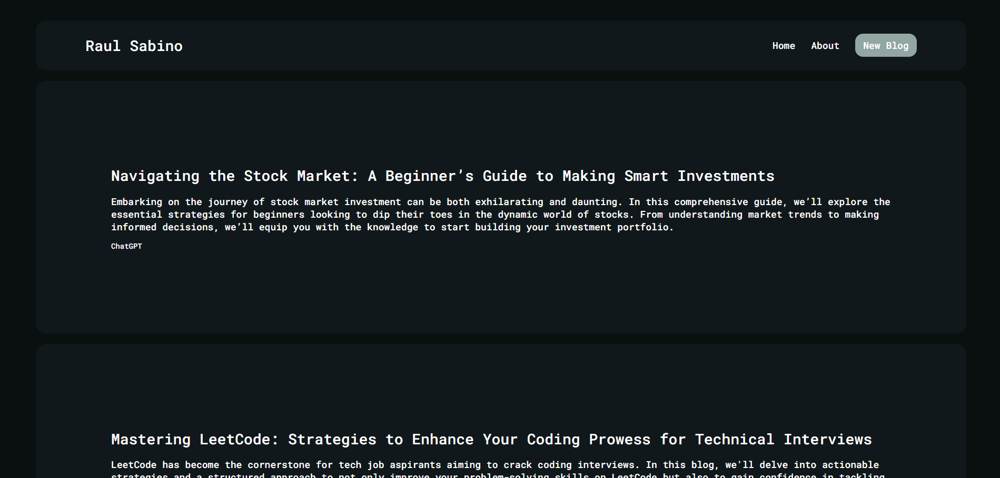
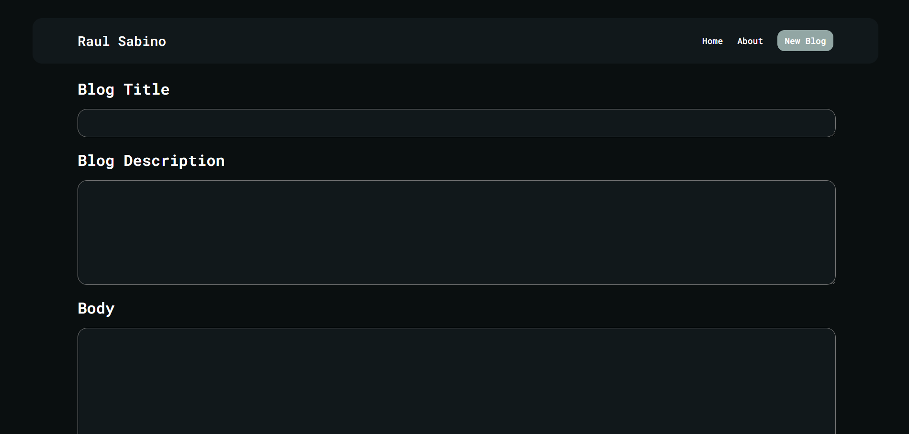

# Blog App

## Description

This Blog application is a simple blog built using Express, React, and MongoDB. It offers the ability for users to create blog posts with titles, bodies, and authors. The application was primarly created as a personal project to learn more about express.

## Features

- **Create**: Add new blog posts with titles, bodies, and authors.
- **Read**: View blog posts with their titles, bodies, and authors.
- **Delete**: Remove blog posts from the platform.

## Live Demo

Visit the live application here: [Raul's Blog](https://rauls-blog.onrender.com/) (If the page takes too long to load, this may be because the server being hosted on a free-tier cloud service, which enters a sleep mode during periods of inactivity)

## Screenshots

  

  

## Built With

- [Express.js](https://expressjs.com/) - The web framework used
- [React](https://reactjs.org/) - The front-end library
- [MongoDB](https://www.mongodb.com/) - Database platform